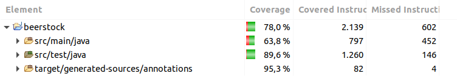
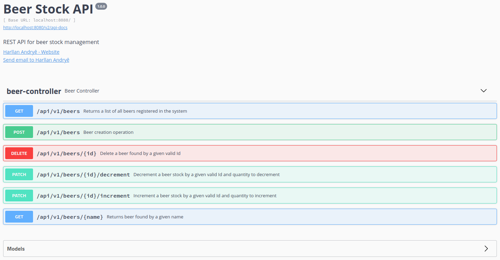

# API-REST-de-gerenciamento-de-estoques-de-cerveja


### Desenvolvimento de testes unitários para validar uma API REST de gerenciamento de estoques de cerveja.

Este projeto foi feito baseado nas aulas da Digital Innovation One e pode ser encontrado [aqui](https://github.com/rpeleias/beer_api_digital_innovation_one/), porém fiz algumas modificações e o meu está um pouco diferente do que foi feito em aula.

**Descrição do projeto**

Neste Labs você irá aprender a testar, unitariamente, uma API REST para o gerenciamento de estoques de cerveja. Vamos construir **testes unitários** para validar o nosso sistema de gerenciamento de estoques de cerveja desenvolvido em **Spring Boot**, e também apresentar os principais conceitos e vantagens de criar testes unitários com *JUnit* e *Mockito*. Além disso, vamos também mostrar como desenvolver funcionalidades da nossa API através da prática do **TDD**.

O que foi abordado:

- A pirâmide (*UI, Integration e Unit Tests*) dos tipos de testes e a importância de cada tipo de teste durante o ciclo de desenvolvimento.
- Foco nos testes unitários: mostrar o porque é importante o desenvolvimento destes tipos de testes como parte do ciclo de desenvolvimento de software.
- Principais frameworks para testes unitários em Java: JUnit, Mockito e Hamcrest.
- Desenvolvimento de testes unitários: criação, listagem, consulta por nome e exclusão de cervejas.
- TDD.

Pré-requisitos para executar o projeto:
- Java 11 (foi utilizado o openjdk-11);
- Maven 3.6.3;
- IDE de sua escolha (utilizei o [STS](https://spring.io/tools).)

### :computer: Rodar a aplicação
---

Para executar o projeto no terminal, digite o seguinte comando:

```shell script
$ mvn spring-boot:run
```

Após executar o comando acima, o seguinte endereço da API estará disponível:

```
http://localhost:8080/api/v1/beers
```

Para executar os testes desenvolvidos, execute o seguinte comando:

```shell script
$ mvn clean test
OU
$ $ mvn test jacoco:report
```

O [JaCoCo](https://www.jacoco.org/jacoco/) é uma biblioteca que gera um relatório de cobertura dos testes de código. O relatório, após rodar o comando, fica em ``` target/site/jacoco/index.html ```.

Caso use o Eclipse, pode-se utilizar o *coverage* para verificar a cobertura dos testes. Basta instalar o plug-in pelo Marketplace, [aqui explica como](https://www.eclemma.org/installation.html).

<kbd>
  
</kbd>

<br>
<br>

Foi utilizado o Swagger 2 para Spring REST web service, usando a biblioteca [Springfox](https://github.com/springfox/springfox).
O Springfox irá retornar um JSON com as informações da documentação da API e para verificar se está funcionando, acesse: 

```
http://localhost:8080/v2/api-docs
```

Mas, para melhor visualização das informações, usamos o Swagger UI, no endereço:

```
http://localhost:8080/swagger-ui.html
```

<kbd>
  
</kbd>

<br>
<br>

Fluxo da API:
```
Controller > Service > Repository > Entity
```

### :x: Erro com Eclipse IDE
---

Após importar o projeto na IDE Eclipse, pode ocorrer o seguinte erro:

```shell script
__ cannot be resolved to a type BeerController.java	/beerstock/src/main/java/one/digitalinnovation/beerstock/controller	line ...
```

Esse erro é devido ao Eclipse não reconhecer a biblioteca [Lombok](https://projectlombok.org/), que é utilizada no projeto para ajudar a escrever menos código usando anotações que gera métodos automaticamente.

Para resolver esse problema é necessário instalar o Lombok no Eclipse e [esse link pode ajudar](https://howtodoinjava.com/automation/lombok-eclipse-installation-examples/) no passo a passo de como fazer a instalação.
